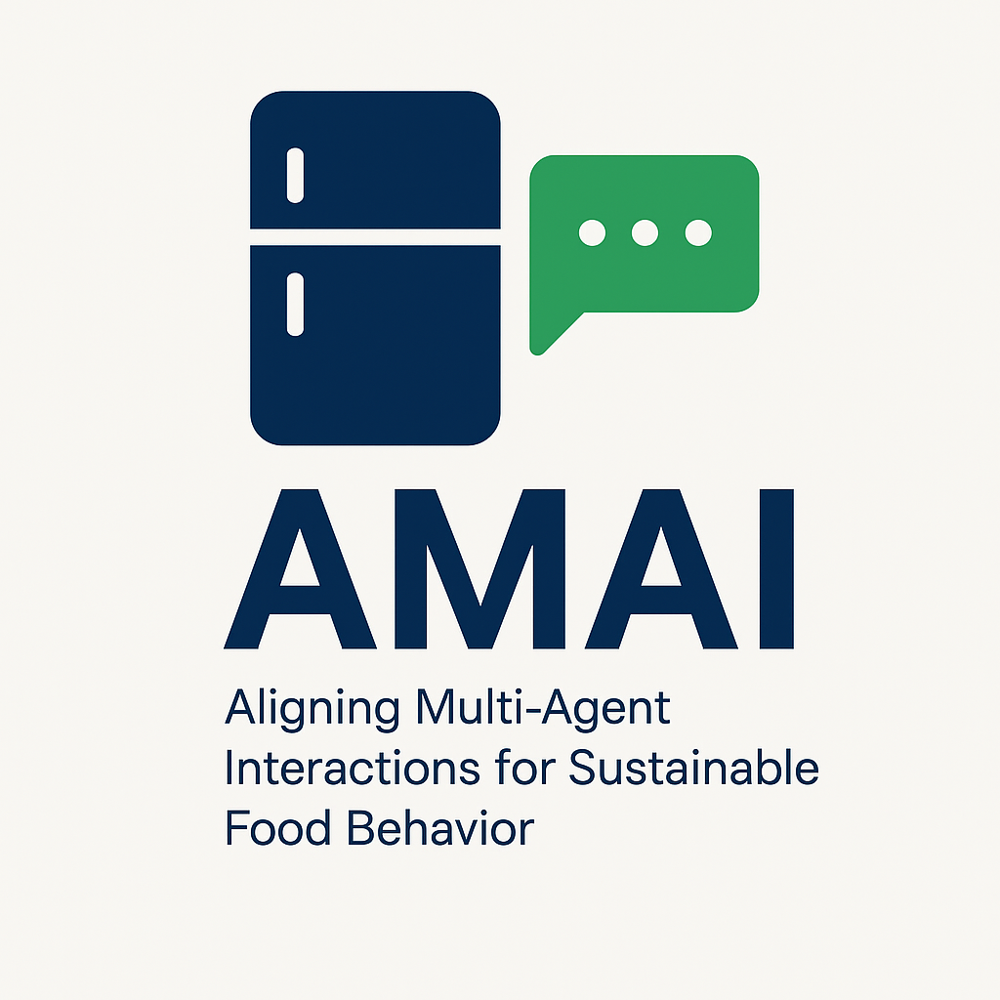

# AMAI: Aligning Multi-Agent Interactions for Sustainable Food Behavior  
*Villum Experiment, 2026–2028*

---

## **Project Summary**

One-third of all food produced is wasted—driving unnecessary emissions and climate harm. Despite widespread awareness, simply tracking food waste rarely leads to change. AMAI rethinks how AI can support more sustainable everyday choices.

The project develops a multilingual assistant that uses large language models to detect food waste risks (e.g., expiring high-emission foods) and suggest personalized, persuasive solutions—like recipe ideas tailored to what’s in your fridge. It integrates environmental tools and behavior modeling to go beyond convenience and align with user-defined sustainability goals.

---

## **Objectives**

1. **Can AI help people reduce food waste by aligning with their long-term values—not just preferences?**  
2. **How can interactive systems balance persuasive communication with user autonomy?**  
3. **What is the real-world impact of goal-aligned AI on household behavior?**

---

## **Approach**

* A mobile app where users receive daily recipe and action suggestions  
* Integration of LLMs with environmental impact calculators and food inventory tools  
* Narrative generation based on user values and behavior predictions  
* Longitudinal user study with 20–30 households  
* Evaluation of behavior change, CO₂ reduction, and user trust

---

## **Team**

### **Principal Investigator**

* [**Daniel Hershcovich**](https://danielhers.github.io/)  
  Tenure-Track Assistant Professor, Department of Computer Science, University of Copenhagen

---

## **Deliverables**

* Open-source prototype of the AMAI assistant  
* Dataset from the year-long behavioral study  
* Research publications on behavior-aligned AI and sustainable HCI  
* Design guidelines for persuasive, multilingual food-tech interfaces

---

## **Contact**

For collaboration or inquiries:  
📧 dh@di.ku.dk

